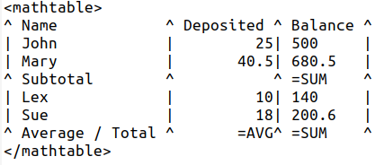
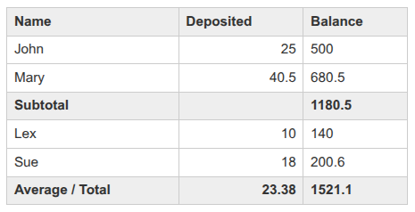

# DokuWiki Plugin: AV Math Table

Adds math to columns for Dokuwiki tables.

## Install and documentation:

* https://www.dokuwiki.org/plugin:avmathtable
* Licence: GPL-2.0 (https://www.gnu.org/licenses/old-licenses/gpl-2.0.en.html)
* Author: Sherri W. (https://syntaxseed.com)

## Usage

### Format



```
<mathtable>
^ Name            ^ Deposited ^ Balance ^
| John            |         25| 500     |
| Mary            |       40.5| 680.5   |
^ Subtotal        ^           ^ =TOT    ^
| Lex             |         10| 140     |
| Sue             |         18| 200.6   |
^ Average / Total ^       =AVG^ =SUM    ^
</mathtable>
```

Column headers (^) and alignment are preserved.

### Available Commands

Commands operate on the **numeric** column values above them. Non-numeric or cells with these special commands are ignored.

* `=AVG` - Calculate the average of the numeric values in this column so far.
* `=SUM` - Calculate the sum of the numeric values in this entire column so far.
* `=TOT` - Calculate the total of the numeric values in this column since the last call to =TOT. Can be a section total.
* `=ROW` - Works like SUM but for the current row. Sums the cells to the left of the one where this command is called. Does not work with other commands in the row. Ie can't sum a row of totals (yet).
* `=CNT` - Display the number of numeric values in this column so far.
* `=MAX` - Display the maximum numeric value in the column.
* `=MIN` - Display the minimum numeric value in the column.

### Output



## To Do

Not yet tested with cells that span multiple columns or rows.

## Version History

2026-03-14 - Add the TOT command. Added the (experimental) ROW command. Started gathering info about rows.
2026-02-26 - Make it work with 0 decimal numbers like for currency (8.00). Add MIN/MAX commands.
2026-02-25 - First version with basic functions.